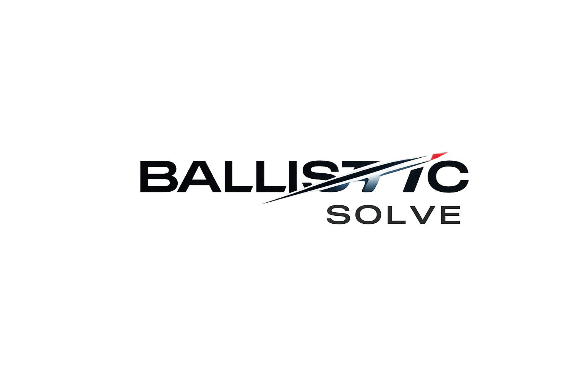

<div align="center">

   <picture>
     <source media="(prefers-color-scheme: dark)" srcset="docs/images/hero-dark.png">
     <source media="(prefers-color-scheme: light)" srcset="docs/images/hero-dark.png">
     
   </picture>
   
   [](https://github.com/YudoTLE/ballistic-solve/actions/workflows/ci.yml)
   [](https://pypi.org/project/ballistic-solve/)
   [](https://www.python.org/downloads/)
   [](https://isocpp.org/)
   [](https://opensource.org/licenses/MIT)
   
</div>

**ballistic-solve** is a high-performance C++ library with Python bindings for computing ballistic trajectories and firing solutions. It solves intercept problems for moving targets while modeling real-world physics including gravity, drag, wind, and atmospheric variations.

### Key Features

- **Real-world physics** — Account for gravity, air resistance, wind, and atmospheric conditions
- **Moving targets interception** — Calculate firing solutions to intercept targets with any motion pattern
- **High performance** — Fast C++ core with Eigen for real-time trajectory computation

---

## Installation

```bash
pip install ballistic-solve
```

---

## Quick Start

```python
import numpy as np
from ballistic_solve import Ballistic, Environment, Projectile

environment = Environment.earth_standard()
projectile = Projectile.gsh30_round()

ballistic = Ballistic(environment, projectile)

def target_position(t):
    p = np.array([1200.0, 150.0, 5200.0])
    v = np.array([270.0, 20.0, -5.0])
    a = np.array([0.0, -15.0, -2.0])

    return p + v * t + 0.5 * a * t**2

solution = ballistic.solve_earliest(
    target_position=target_position,
    platform_position=np.array([0.0, 0.0, 5000.0]),
    platform_velocity=np.array([250.0, 0.0, 0.0]),
    projectile_speed=860.0,
    time_range=(0.0, 5.0)
)

if solution:
    print(f"Fire direction: {solution.direction}")
    print(f"Time to intercept: {solution.time:.3f}s")
    print(f"Interception error: {solution.error:.4e}m")
    print(f"Computation time: {solution.computation_time * 1e3:.2f}ms")
else:
    print("No solution")
```

---

## Dependencies

- **Eigen** — Vectorized linear algebra and Levenberg-Marquardt optimization
- **Boost** — Adaptive-step ODE integration and root-finding

---

## License

[MIT](LICENSE) © Ariyudo Pertama
